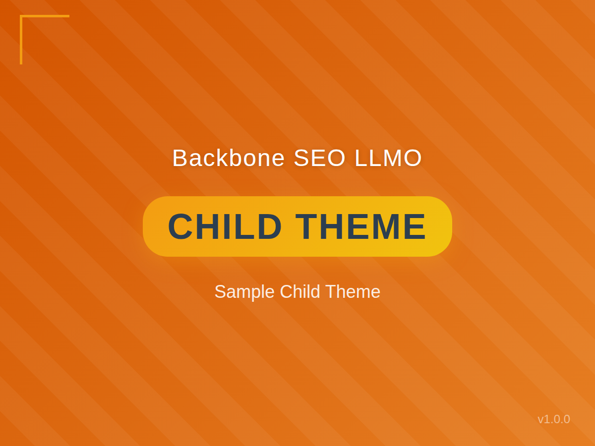

# Backbone SEO LLMO Child Theme




A customizable child theme for Backbone SEO LLMO WordPress theme with comprehensive documentation and examples.

---

## Overview

**Backbone SEO LLMO Child Theme** は、[Backbone SEO LLMO](https://github.com/TsuyoshiKashiwazaki/wp-theme-backbone-seo-llmo) テーマ専用の子テーマサンプルです。親テーマの機能を継承しながら、安全にカスタマイズを行うための基盤を提供します。

子テーマを使用することで、親テーマの更新によってカスタマイズが失われる心配がなく、安全かつ効率的にテーマをカスタマイズできます。

---

## Key Features

- ✅ **Safe Updates**: 親テーマを更新してもカスタマイズが消えない
- ✅ **Easy Customization**: 必要なファイルだけを編集すればOK
- ✅ **Reversible**: 子テーマを無効化すれば元の状態に戻せる
- ✅ **Learning Friendly**: 親テーマのコードを参考にしながら学べる
- ✅ **Comprehensive Documentation**: 充実したドキュメントとサンプルコード
- ✅ **Admin Manual Page**: 管理画面にカスタマイズガイドを表示
- ✅ **Multiple Examples**: 7つのカスタマイズ例をコメントで提供

---

## Quick Start

### Installation

#### 重要: GitHubからダウンロードする場合の注意

GitHubから親テーマと子テーマをダウンロードする場合は、必ず以下の手順に従ってください：

1. **親テーマのインストール**:
   - [wp-theme-backbone-seo-llmo](https://github.com/TsuyoshiKashiwazaki/wp-theme-backbone-seo-llmo) からZIPをダウンロード
   - WordPress管理画面 > **外観 > テーマ > 新規追加 > テーマのアップロード** からインストール
   - ⚠️ **重要**: インストール後、ディレクトリ名が `wp-theme-backbone-seo-llmo-main` になっていることを確認

2. **子テーマのインストール**:
   - [wp-theme-backbone-seo-llmo-child](https://github.com/TsuyoshiKashiwazaki/wp-theme-backbone-seo-llmo-child) からZIPをダウンロード
   - WordPress管理画面 > **外観 > テーマ > 新規追加 > テーマのアップロード** からインストール
   - ディレクトリ名が `wp-theme-backbone-seo-llmo-child-main` になっていることを確認
   - 子テーマを**有効化**

3. **動作確認**:
   - サイトが正しく表示されることを確認
   - エラーが出る場合は、下記の「トラブルシューティング」を参照

#### Method 1: このサンプルを使う場合（既に配置済み）

1. WordPress管理画面にログイン
2. **外観 > テーマ** を開く
3. **Backbone SEO LLMO Child** を見つける
4. **有効化** をクリック

#### Method 2: 手動で作成する場合

```bash
# 1. 子テーマディレクトリを作成
cd wp-content/themes/
mkdir my-child-theme

# 2. 最低限必要なファイルを作成
cd my-child-theme
```

**style.css** (必須):
```css
/*
Theme Name: My Child Theme
Template: wp-theme-backbone-seo-llmo-main
Version: 1.0.0
*/
```

⚠️ **注意**: `Template:` の値は、**親テーマのディレクトリ名と完全に一致**する必要があります。GitHubからダウンロードした場合は `wp-theme-backbone-seo-llmo-main` となります。

**functions.php** (推奨):
```php
<?php
function my_child_enqueue_styles() {
    wp_enqueue_style('parent-style', get_template_directory_uri() . '/style.css');
    wp_enqueue_style('child-style', get_stylesheet_uri(), array('parent-style'));
}
add_action('wp_enqueue_scripts', 'my_child_enqueue_styles');
```

### System Requirements

- **WordPress**: 5.0 以上
- **PHP**: 7.2 以上
- **親テーマ**: Backbone SEO LLMO (必須)

---

## Theme Structure

### Template Files

子テーマでは、親テーマの任意のテンプレートファイルをオーバーライドできます：

```
backbone-seo-llmo-child/
├── style.css              # 必須: テーマ情報 + カスタムCSS
├── functions.php          # 推奨: カスタム関数
├── screenshot.png         # テーマプレビュー画像
├── README.md             # このファイル
├── readme.txt            # WordPress.org 形式のドキュメント
├── CHANGELOG.md          # 変更履歴
├── .gitignore            # Git除外設定
│
# カスタムファイル（必要に応じて追加）
├── header.php            # ヘッダーテンプレートのカスタマイズ
├── footer.php            # フッターテンプレートのカスタマイズ
├── template-custom.php   # カスタムページテンプレート
├── js/
│   └── custom.js         # カスタムJavaScript
└── css/
    └── custom.css        # 追加のCSS
```

### Directory Structure

```
backbone-seo-llmo-child/
│
├── style.css              # テーマ情報 + カスタムCSS
├── functions.php          # スタイルエンキュー + カスタム関数
├── screenshot.png         # 445KB テーマプレビュー画像
├── README.md             # GitHub用ドキュメント（このファイル）
├── readme.txt            # WordPress.org形式ドキュメント
├── CHANGELOG.md          # 変更履歴
└── .gitignore            # Git除外設定
```

**重要**: 必要なファイルだけをコピーしてください。全ファイルをコピーする必要はありません。

---

## Customization

### 1. CSS Customization

`style.css` にカスタムCSSを追加：

```css
/* ヘッダーの背景色を変更 */
.site-header {
    background: #2c3e50 !important;
}

/* リンクの色を変更 */
a {
    color: #e74c3c;
}

/* サイトタイトルのフォントサイズを変更 */
.site-title {
    font-size: 2.5em;
}
```

### 2. PHP Customization

`functions.php` にカスタム関数を追加：

```php
// 抜粋文の長さを変更
function my_excerpt_length($length) {
    return 30;
}
add_filter('excerpt_length', 'my_excerpt_length');

// カスタムウィジェットエリアを追加
function my_custom_widget_area() {
    register_sidebar(array(
        'name'          => 'Custom Sidebar',
        'id'            => 'custom-sidebar',
        'before_widget' => '<div class="widget">',
        'after_widget'  => '</div>',
    ));
}
add_action('widgets_init', 'my_custom_widget_area');
```

### 3. Template Customization

親テーマのテンプレートファイルを子テーマにコピーして編集：

```bash
# 例: header.php をカスタマイズ
cp ../backbone-seo-llmo/header.php ./header.php
# header.php を編集
```

### 4. JavaScript Customization

カスタムJavaScriptを追加：

```php
// functions.php に追加
function my_custom_scripts() {
    wp_enqueue_script(
        'custom-js',
        get_stylesheet_directory_uri() . '/js/custom.js',
        array('jquery'),
        '1.0.0',
        true
    );
}
add_action('wp_enqueue_scripts', 'my_custom_scripts');
```

---

## Customization Examples

このサンプル子テーマの `functions.php` には、7つのカスタマイズ例がコメントで記載されています：

1. **Custom JavaScript**: カスタムJavaScriptの読み込み
2. **Widget Area**: カスタムウィジェットエリアの追加
3. **Custom Post Type**: カスタム投稿タイプの登録
4. **Excerpt Length**: 抜粋文の長さ変更
5. **Custom Hook**: カスタムフックの実装
6. **Function Override**: 親テーマ関数の上書き
7. **Image Size**: カスタム画像サイズの追加

詳細は `functions.php` のコメントを参照してください。

---

## Admin Manual Page

このテーマには、WordPress管理画面にカスタマイズガイドを表示する機能が組み込まれています。

**アクセス方法**:
1. WordPress管理画面にログイン
2. **外観 > 子テーママニュアル** をクリック

管理画面では、以下の情報を確認できます：
- 子テーマの基本的な使い方
- カスタマイズ例とコードサンプル
- よくある質問と回答

---

## WordPress Theme Support

このテーマは親テーマの機能をすべて継承します。親テーマがサポートする機能：

- Custom Logo
- Custom Header
- Custom Background
- Post Thumbnails
- HTML5 Markup
- Title Tag
- Automatic Feed Links
- Navigation Menus
- Widget Areas
- Editor Styles

---

## FAQ

### Q1. 子テーマに全ファイルをコピーする必要がありますか？

**A.** いいえ、必要ありません。カスタマイズしたいファイルだけをコピーしてください。

### Q2. 親テーマを更新したら子テーマの設定は消えますか？

**A.** いいえ、消えません。それが子テーマの最大のメリットです。

### Q3. 子テーマのファイルが優先されますか？

**A.** はい。同じ名前のファイルがある場合、子テーマのファイルが優先されます。

### Q4. functions.php は上書きされますか？

**A.** いいえ。`functions.php` だけは特別で、親と子の両方が実行されます。

### Q5. カスタマイザーの設定はどうなりますか？

**A.** カスタマイザーの設定は親テーマと子テーマで共有されます。

---

## Troubleshooting

### 子テーマが表示されない

1. `style.css` に正しいヘッダー情報があるか確認
2. `Template: backbone-seo-llmo` が正しいか確認
3. ファイルのパーミッションを確認

### スタイルが適用されない

1. `functions.php` でスタイルを正しくエンキューしているか確認
2. ブラウザのキャッシュをクリア
3. WordPress管理画面 > 設定 > パーマリンク を保存

### 親テーマが見つからないエラー

このエラーは、子テーマの `style.css` に記載された `Template:` の値と、実際の親テーマのディレクトリ名が一致していない場合に発生します。

#### ✅ ディレクトリ名を確認する方法

**FTPまたはサーバーのファイルマネージャーで確認**:
1. `/wp-content/themes/` ディレクトリを開く
2. 親テーマのディレクトリ名を確認
   - GitHubからダウンロードした場合: `wp-theme-backbone-seo-llmo-main`
   - 手動で配置した場合: `backbone-seo-llmo` など

**WordPress管理画面で確認**:
1. **外観 > テーマ** を開く
2. 親テーマが表示されているか確認
3. 表示されていない場合は、ディレクトリ名に問題がある可能性が高い

#### 🔧 解決方法

**方法1: 子テーマの `style.css` を修正**（推奨）

1. 子テーマディレクトリの `style.css` を開く
2. `Template:` の行を親テーマのディレクトリ名と一致させる：

```css
/* GitHubからダウンロードした場合 */
Template: wp-theme-backbone-seo-llmo-main

/* 手動で配置した場合（ディレクトリ名が backbone-seo-llmo の場合） */
Template: backbone-seo-llmo
```

3. ファイルを保存
4. WordPress管理画面で子テーマを再度有効化

**方法2: 親テーマのディレクトリ名を変更**（非推奨）

FTPまたはサーバーのファイルマネージャーで、親テーマのディレクトリ名を `Template:` の値と一致させる。
- 例: `wp-theme-backbone-seo-llmo-main` → `backbone-seo-llmo`

⚠️ **注意**: この方法は、将来の更新時に同じ問題が再発する可能性があります。

#### 📌 確認事項

- [ ] 親テーマが `/wp-content/themes/` にインストールされているか
- [ ] 親テーマのディレクトリ名を確認したか
- [ ] 子テーマの `style.css` の `Template:` の値が親テーマのディレクトリ名と**完全に一致**しているか（大文字小文字も含む）
- [ ] 子テーマを保存後、WordPress管理画面で再度有効化したか

#### 💡 よくあるパターン

| 親テーマディレクトリ名 | 子テーマの `Template:` 設定 | 結果 |
|-------------------|---------------------|------|
| `wp-theme-backbone-seo-llmo-main` | `Template: wp-theme-backbone-seo-llmo-main` | ✅ 正常動作 |
| `wp-theme-backbone-seo-llmo-main` | `Template: backbone-seo-llmo` | ❌ エラー |
| `backbone-seo-llmo` | `Template: backbone-seo-llmo` | ✅ 正常動作 |
| `backbone-seo-llmo` | `Template: wp-theme-backbone-seo-llmo-main` | ❌ エラー |

---

## Changelog

変更履歴の詳細は [CHANGELOG.md](CHANGELOG.md) を参照してください。

### [1.0.0] - 2025-11-10

#### Added
- Initial release of Backbone SEO LLMO Child theme
- Basic child theme structure with parent theme dependency
- Style enqueue functionality for both parent and child themes
- Admin manual page with comprehensive customization guide
- Seven commented code examples in functions.php
- Theme screenshot (screenshot.png)
- Comprehensive README.md and readme.txt documentation

---

## License

このテーマは **GPL v2 or later** ライセンスで配布されています。

```
This program is free software; you can redistribute it and/or modify
it under the terms of the GNU General Public License as published by
the Free Software Foundation; either version 2 of the License, or
(at your option) any later version.

This program is distributed in the hope that it will be useful,
but WITHOUT ANY WARRANTY; without even the implied warranty of
MERCHANTABILITY or FITNESS FOR A PARTICULAR PURPOSE. See the
GNU General Public License for more details.
```

ライセンスの詳細: https://www.gnu.org/licenses/gpl-2.0.html

---

## Support & Development

### GitHub Repository

- **Child Theme**: https://github.com/TsuyoshiKashiwazaki/wp-theme-backbone-seo-llmo-child
- **Parent Theme**: https://github.com/TsuyoshiKashiwazaki/wp-theme-backbone-seo-llmo

### Bug Reports & Feature Requests

バグ報告や機能リクエストは、GitHubのIssuesページでお願いします。

### Documentation

- [WordPress Codex: 子テーマ](https://wpdocs.osdn.jp/%E5%AD%90%E3%83%86%E3%83%BC%E3%83%9E)
- [親テーマドキュメント](https://github.com/TsuyoshiKashiwazaki/wp-theme-backbone-seo-llmo/blob/main/README.md)

---

## Contributing

貢献を歓迎します！プルリクエストを送る前に、以下をご確認ください：

1. コードがWordPressコーディング規約に準拠しているか
2. 変更内容が明確に説明されているか
3. 必要に応じてドキュメントも更新されているか

---

## Keywords

WordPress, Child Theme, Backbone SEO LLMO, Customization, Theme Development, SEO, LLMO

---

**Developed by**: Tsuyoshi Kashiwazaki
**Author URI**: https://www.tsuyoshikashiwazaki.jp/profile/
**Version**: 1.0.0
**Last Updated**: 2025-11-10
